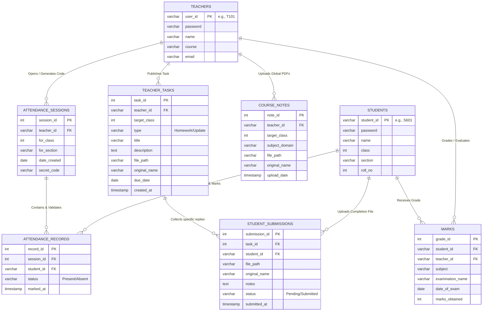

# Entity-Relationship (ER) Diagram

```mermaid
erDiagram
    %% Core Identity Entities
    STUDENTS {
        varchar student_id PK "e.g., S601"
        varchar password
        varchar name
        int class
        varchar section
        int roll_no
    }

    TEACHERS {
        varchar user_id PK "e.g., T101"
        varchar password
        varchar name
        varchar course
        varchar email
    }

    %% Live Attendance & Class Polling System
    ATTENDANCE_SESSIONS {
        int session_id PK
        varchar teacher_id FK
        int for_class
        varchar for_section
        date date_created
        varchar secret_code
    }

    ATTENDANCE_RECORDS {
        int record_id PK
        int session_id FK
        varchar student_id FK
        varchar status "Present/Absent"
        timestamp marked_at
    }

    %% Academic File & Notes System
    COURSE_NOTES {
        int note_id PK
        varchar teacher_id FK
        int target_class
        varchar subject_domain
        varchar file_path
        varchar original_name
        timestamp upload_date
    }

    %% Homework & Assignment Pipeline
    TEACHER_TASKS {
        int task_id PK
        varchar teacher_id FK
        int target_class
        varchar type "Homework/Update"
        varchar title
        text description
        varchar file_path
        varchar original_name
        date due_date
        timestamp created_at
    }

    STUDENT_SUBMISSIONS {
        int submission_id PK
        int task_id FK
        varchar student_id FK
        varchar file_path
        varchar original_name
        text notes
        varchar status "Pending/Submitted"
        timestamp submitted_at
    }

    %% Grading Matrix Node
    MARKS {
        int grade_id PK
        varchar student_id FK
        varchar teacher_id FK
        varchar subject
        varchar examination_name
        date date_of_exam
        int marks_obtained
    }

    %% Relational Mappings & Constraints
    TEACHERS ||--o{ ATTENDANCE_SESSIONS : "Opens / Generates Code"
    TEACHERS ||--o{ COURSE_NOTES : "Uploads Global PDFs"
    TEACHERS ||--o{ TEACHER_TASKS : "Publishes Task"
    TEACHERS ||--o{ MARKS : "Grades / Evaluates"

    STUDENTS ||--o{ ATTENDANCE_RECORDS : "Inputs Code & Marks"
    STUDENTS ||--o{ STUDENT_SUBMISSIONS : "Uploads Completion File"
    STUDENTS ||--o{ MARKS : "Receives Grade"

    ATTENDANCE_SESSIONS ||--o{ ATTENDANCE_RECORDS : "Contains & Validates"
    TEACHER_TASKS ||--o{ STUDENT_SUBMISSIONS : "Collects specific replies"
```
